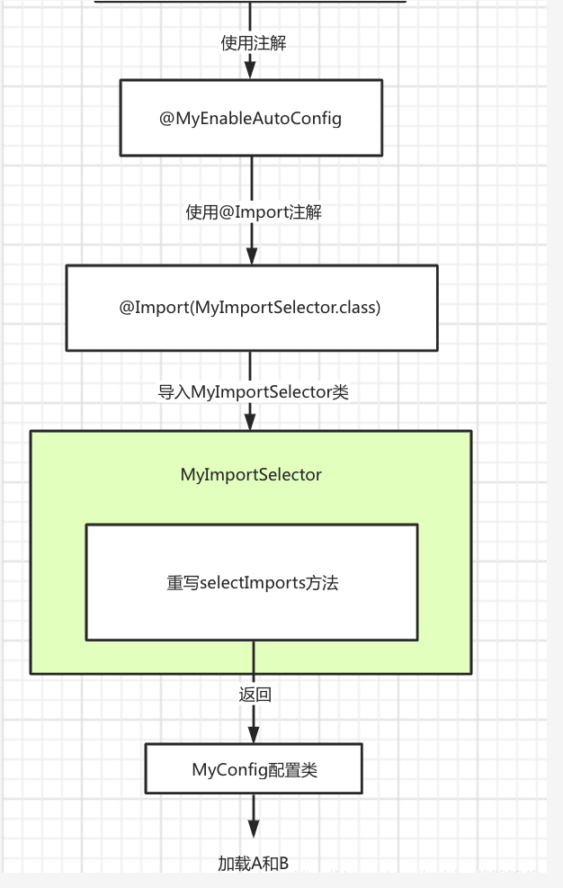
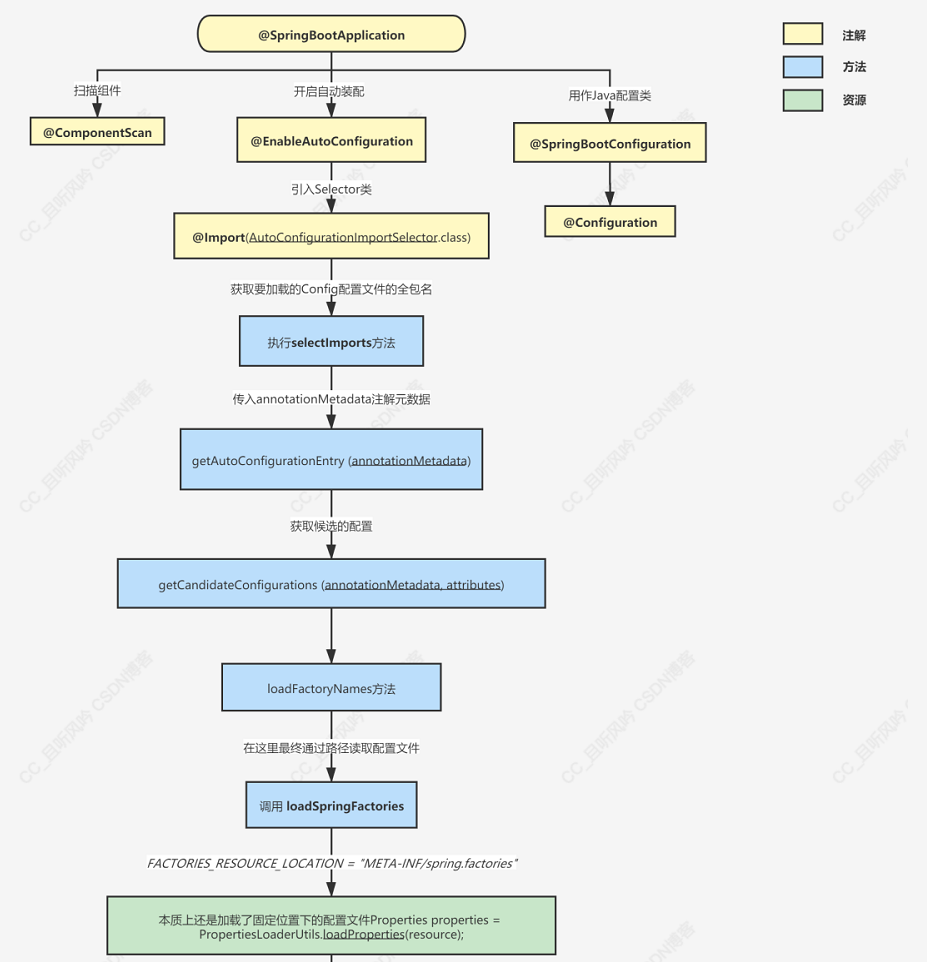

## @Import注解的使用
这个注解一般用于引入需要的配置类

- 可以是普通的Bean
- 可以是config配置类（其中包括很多的Bean）
- 可以是Bean注册器（BeanDefinitionRegister）
- 可以是Bean选择器（ImportSelector）

本例中采用了四种方式去引入配置类

## 1、直接引入普通的Bean
  参考 **@MyEnableAutoConfigByBean**

    直接通过@Import(TestB.class)，将TestB这个类引入到当前的上下文中，将其作为一个bean注册到IOC容器中
    
## 2、引入config配置类
  参考  **@MyEnableAutoConfigByConfig**
 
    和上面直接引入普通的Bean其实差不多，只是这个Bean变成了一个配置类，然后其中包含了很多的Bean
    @Import(MyConfig.class)，引入了MyConfig配置类，在这个配置类中包含了TestA和TestB两个bean.

## 3、Bean注册器
  参考  **@MyEnableAutoConfigByDefinitionRegister**
  
    这个是事先定义好一个Bean注册器，然后将其使用@Import注解引入到当前上下文使其生效
    效果其实和上面的引入config配置类一样，都是同时注册多个Bean
    @Import(MyImportBeanDefinitionRegister.class)
    
    其中MyImportBeanDefinitionRegister是ImportBeanDefinitionRegistrar接口的具体实现，
    通过实现registerBeanDefinitions方法来手动注册Bean

## 4、Bean选择器
  参考  **MyEnableAutoConfig**
  
    效果同上
    这里需要注意的一点就是，springboot的starter就是基于这个实现的
    通过spi机制读取到配置文件中的配置类信息，然后动态的加载
    
    本例中参考spi机制读取配置文件信息然后加载类，简单实现
    
    @Import(MyImportSelector.class)
    首先引入MyImportSelector选择器，这是ImportSelector接口的一个实现类，实现了selectImports方法，
    此方法中读取应用上下文的property/myAutoProperty文件，并将读取到的类的全路径名返回，然后会自动加载
    
整体的加载流程如下图

## springboot 自动装配流程
